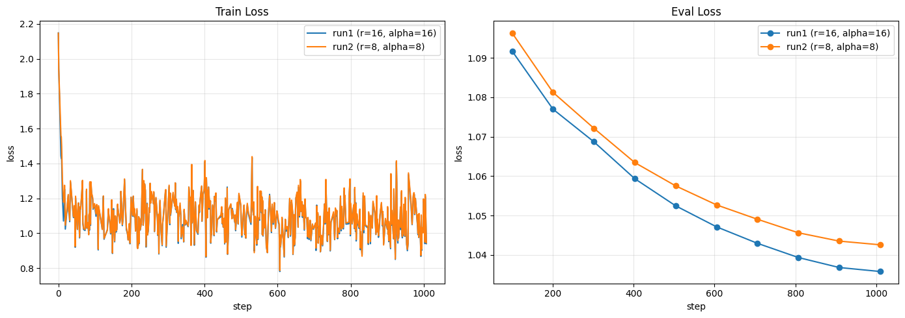

# Legal RAG SLM

Fine-tuned small language model + advanced RAG pipeline for answering Indonesian
labor-law questions grounded in official regulations (UU/PP), with citation and a
local-first design so no sensitive document ever needs to leave the environment.

Two components, trained and integrated end-to-end:
1. **Fine-tuned SLM** — QLoRA SFT + GRPO reinforcement learning with custom reward
   functions, on top of `Qwen2.5-3B-Instruct`.
2. **RAG pipeline** — hybrid retrieval (BM25 + dense), parent-child chunking, HyDE
   query expansion, cross-encoder reranking, and web-search fallback for out-of-scope
   queries.

---

## Features

- **Hybrid retrieval**: BM25 (keyword) + dense embeddings (`BAAI/bge-m3`), weighted
  ensemble, tuned for legal text where exact term/article matches matter.
- **Parent-child chunking**: small chunks for accurate vector search, larger parent
  chunks for full context at generation time.
- **Metadata-aware citation**: every retrieved chunk carries its source law
  (`uu_number`) and article references (`pasal_refs`), surfaced directly in the answer.
- **HyDE query expansion**: generates hypothetical answers to enrich retrieval for
  vague or under-specified questions.
- **Cross-encoder reranking** (`bge-reranker-base`) with relevance-score-based fallback
  to DuckDuckGo web search when local documents don't cover the query.
- **Custom GRPO reward shaping**: 4 reward functions covering output format,
  reasoning-length, correctness (ROUGE-based), and language consistency.
- **Fully local generation**: the RAG pipeline's LLM is the project's own fine-tuned
  model, not a third-party API — required for handling confidential legal documents.

---

## Architecture

```
PDF (UU/PP) ──► Ingestion ──► Metadata Enrichment ──► Chunking (parent/child)
                                                            │
                                                            ▼
                                      Embedding (bge-m3) ──► ChromaDB
                                                            │
Query ──► HyDE (optional) ──► Ensemble Retriever (BM25 + Dense) ──► Reranker
                                                            │
                                              score < threshold?
                                              ├── yes → DuckDuckGo fallback
                                              └── no  → local context
                                                            │
                                                            ▼
                                      Fine-tuned SLM (GRPO) ──► Answer + citations
```

---

## Tech Stack

| Layer | Choice |
|---|---|
| Base model | `unsloth/Qwen2.5-3B-Instruct` |
| Fine-tuning | Unsloth + QLoRA (4-bit, double quantization) + TRL `SFTTrainer` / `GRPOTrainer` |
| Training data | `Ichsan2895/alpaca-gpt4-indonesian` |
| Vector DB | ChromaDB (`langchain-chroma`) |
| Embedding | `BAAI/bge-m3` |
| Reranker | `BAAI/bge-reranker-base` (cross-encoder) |
| Retrieval | LangChain (BM25Retriever + EnsembleRetriever) |
| Web fallback | DuckDuckGo (`ddgs`) |
| Generation runtime | HuggingFace `transformers` (`AutoModelForCausalLM`, 4-bit) |
| Compute | Kaggle GPU (T4/P100) |

---

## Fine-Tuning: Approach & Results

### SFT (QLoRA)
Two LoRA configurations were trained (`r=16, alpha=16` and `r=8, alpha=8`) for 1000
steps each, with eval every 100 steps.

`max_steps` was set based on a short throughput benchmark (~0.26 it/s on Kaggle
T4/P100) rather than picked arbitrarily — enough steps for a clear loss curve
comparison across configs, without spending the full ~6h/epoch budget twice.



**Result: `r=16, alpha=16` selected.** Eval loss ends at **1.0358** vs **1.0426** for
`r=8` — and critically, `r=16` is lower at *every* one of the 10 checkpoints, not just
at the final step, which is a much stronger signal than a one-off final-number
comparison. The train/eval generalization gap is nearly identical between the two
configs (Δ ≈ 0.0018), so the lower loss isn't coming at the cost of extra overfitting —
both curves are still descending at step 1000, with no plateau or upward inflection.

### GRPO (reinforcement learning)
`GRPOTrainer` (TRL + Unsloth), 350 steps, ~4 hours on a single Kaggle GPU session, with
4 custom reward functions (`src/reward_functions.py`):

1. **`format_reward_func`** — rewards well-formed `<think>...</think>` structure,
   penalizes malformed/duplicated reasoning tags.
2. **`reasoning_length_reward_func`** — rewards proportionally longer reasoning content
   (tolerant of truncation from token limits).
3. **`correctness_reward_func`** — ROUGE-L similarity between the model's final answer
   and the dataset's ground-truth output.
4. **`language_reward_func`** — penalizes answers that drift into English.

**Calibrating the correctness threshold.** ROUGE-L is a lexical-overlap metric, so a
low score doesn't necessarily mean a wrong answer (it could be a valid paraphrase). To
set `ROUGE_SIMILARITY_THRESHOLD_FINAL` properly, 20 eval samples were manually reviewed
and categorized (unanswerable/corrupted data, open-ended/ambiguous ground truth, valid
paraphrase, genuinely wrong answer):


The review focused on the 0.15–0.28 cluster, where valid paraphrases and wrong answers
overlap in score:

| Score | Category | Note |
|---|---|---|
| 0.161 | Wrong | repetition collapse (same sentence repeated >10x) |
| 0.186 | Valid paraphrase | CNN explanation — same concept, different terms (truncated by token limit) |
| 0.222 | Valid paraphrase | correct core facts, minor detail error |
| 0.231 | Wrong | explicit constraint violated (price outside requested range) |
| 0.272 | Wrong | factual error in story content |

Since the lowest valid-paraphrase score (0.186) and the highest wrong-answer score
(0.272) overlap, no threshold in this range perfectly separates the two classes. The
threshold was set to **0.2** — just below 0.186 — to avoid zeroing out valid answers,
accepting that a small fraction of degenerate outputs (~5% of reviewed samples) may
still receive a false-positive reward. `correctness_reward_func` is the only one of the
4 reward signals that measures answer content, so preserving its signal for correct
answers was prioritized over filtering out every edge case.

**Model checkpoints**: see [`link_huggingface.txt`](link_huggingface.txt).

---

## RAG System: Approach & Results

- **Chunking**: parent chunks (2000/200 chars) for LLM context, child chunks (400/50)
  for vector search — balances retrieval precision with enough context for the
  generator to reason over.
- **Ensemble retriever**: BM25/dense weighted 0.75/0.25. Legal text relies heavily on
  exact terminology and article numbers, so keyword matching is weighted more heavily
  than semantic similarity.
- **Metadata**: each chunk carries `uu_number` (regulation number) and `pasal_refs`
  (article numbers), extracted from the source page before splitting, enabling
  citations in every answer without a separate lookup step.
- **HyDE**: generates 2+ hypothetical answers per query to expand retrieval coverage
  for vague questions, reusing the same model weights as the main generator (no extra
  GPU memory).
- **Reranking + fallback**: top-1 reranker score below a threshold triggers a DuckDuckGo
  web search instead of forcing an answer from irrelevant local documents — an explicit
  guard against hallucinating from weak context.

### Example

```
> Apakah saya berhak mendapat kenaikan gaji jika sudah bekerja lebih dari
  setahun di suatu perusahaan?

Berdasarkan konteks dokumen yang diberikan, Anda berhak mendapat kenaikan
gaji jika sudah bekerja lebih dari setahun di suatu perusahaan.

Sumber Referensi:
- PP No. 51 Tahun 2023, halaman 16
- PP No. 35 Tahun 2021, halaman 25
- PP No. 51 Tahun 2023, halaman 1 — Pasal: 23, 24, 25
```

---

## Setup & Installation

```bash
git clone https://github.com/11erlangga/legal-rag-slm.git
cd legal-rag-slm
pip install -r requirements.txt
```

Notebooks are designed to run on Kaggle (GPU T4/P100). Fine-tuning notebooks (`01`–`03`)
use Unsloth; RAG notebooks (`04`–`06`) intentionally avoid Unsloth to prevent dependency
conflicts between the Unsloth stack and the LangChain/ChromaDB stack — the RAG
generator loads the fine-tuned checkpoint via plain HuggingFace `transformers` instead.

```python
from src.rag.pipeline import build_pipeline, interactive_loop

pipeline = build_pipeline(
    pdf_dir=PDF_DIR,
    hf_repo_id="11erlangga/grpo-qwen25-3b",
    ensemble_weights=(0.75, 0.25),
    use_hyde=True,
    use_fallback=True,
    fallback_threshold=0.0,
)

interactive_loop(pipeline)
```

---

## Project Structure

```
legal-rag-slm/
├── notebooks/
│   ├── 01_sft_experiment{1,2}_*.ipynb
│   ├── 02_model_selection_and_reward_tuning.ipynb
│   ├── 03_grpo_training.ipynb
│   ├── 04_rag_pipeline.ipynb
│   ├── 05_rag_final_evaluation.ipynb
│   └── 06_interactive_demo.ipynb
├── src/
│   ├── data_utils.py         # dataset loading & chat-template formatting
│   ├── model_utils.py        # model/LoRA loading, cold-start SFT
│   ├── reward_functions.py   # 4 GRPO reward functions
│   └── rag/
│       ├── ingestion.py       # PDF loading & validation
│       ├── metadata.py        # regulation/article metadata enrichment
│       ├── chunking.py        # parent-child splitters
│       ├── vectorstore.py     # embedding + ChromaDB
│       ├── retrievers.py      # BM25, ensemble, reranker
│       ├── hyde.py            # hypothetical document expansion
│       ├── web_fallback.py    # DuckDuckGo fallback
│       ├── generation.py      # fine-tuned model loading & prompt construction
│       └── pipeline.py        # RAGPipeline orchestration + interactive loop
├── assets/                # charts referenced in this README
├── requirements.txt
├── link_huggingface.txt
└── README.md
```

---

## Known Limitations & Roadmap

- **Reasoning-trace consistency**: the GRPO-trained `<think>` reasoning format is
  reliable in direct chat inference but doesn't yet generalize consistently to the
  RAG prompt structure — likely a prompt-template mismatch between what the model saw
  during RL training and what it sees wrapped in retrieval context. Aligning the two
  prompt formats (or including RAG-style prompts in GRPO training) is the next planned
  step.
- **`fallback_threshold` is uncalibrated**: currently set to `0.0` against the
  reranker's raw logit score, without empirical validation against in-domain vs.
  out-of-domain query distributions. Planned: calibrate against a labeled query set.
- **`ensemble_weights` (0.75/0.25) is a heuristic**, chosen from domain reasoning
  (legal text favors exact keyword match) rather than a quantitative sweep.
- **`pasal_refs` granularity is per-page**, not per-chunk — a page with multiple
  articles has all its chunks inherit the same article list. Finer-grained extraction
  is a reasonable follow-up.
- **No source-type distinction in the system prompt** between verified local documents
  and unverified web-fallback results — worth adding given the project's goal of
  avoiding speculative legal answers.
- The GRPO training run did not wire in a live `eval_dataset`, to keep the run inside
  Kaggle's session time limit and avoid OOM risk from the extra generation overhead an
  eval loop adds on top of GRPO's already-heavy per-step sampling.

---

## Model Links

See [`link_huggingface.txt`](link_huggingface.txt) for SFT and GRPO checkpoints on
Hugging Face Hub.