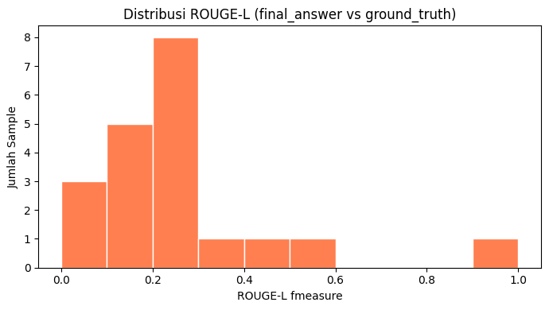

# HakKerja

*"Hak Kerja" is Indonesian for "labor rights."*

An AI assistant that answers Indonesian labor-law questions, grounded in official
regulations (UU/PP) and cited down to the article number. It runs on a small language
model fine-tuned specifically for this task, paired with a retrieval pipeline over the
actual regulation PDFs. Everything runs locally, which matters here since the
underlying use case is confidential legal documents that can't be sent to a third-party
API.

It's built from two pieces trained and wired together end to end:

1. **Fine-tuned SLM**: QLoRA SFT, then GRPO reinforcement learning with custom reward
   functions, on top of `Qwen2.5-3B-Instruct`.
2. **RAG pipeline**: hybrid retrieval (BM25 + dense), parent-child chunking, HyDE
   query expansion, cross-encoder reranking, and a web-search fallback for anything
   outside the local documents.

---

## Features

- **Hybrid retrieval.** BM25 (keyword) and dense embeddings (`BAAI/bge-m3`) combined in
  a weighted ensemble. Legal text leans heavily on exact terms and article numbers, so
  keyword matching carries most of the weight.
- **Parent-child chunking.** Small chunks for accurate vector search, larger parent
  chunks for full context once the generator actually needs to answer.
- **Citations by default.** Every chunk carries its source regulation (`uu_number`) and
  article numbers (`pasal_refs`), so answers can point back to a specific `Pasal`
  instead of just "the document."
- **HyDE query expansion.** Generates a couple of hypothetical answers per query before
  retrieving, which helps with vague or under-specified questions.
- **Reranking with a fallback.** A cross-encoder (`bge-reranker-base`) reorders results,
  and if the top score is too low the system falls back to a DuckDuckGo search instead
  of forcing an answer out of weak local context.
- **Custom GRPO rewards.** Four reward functions covering output format, reasoning
  length, correctness (ROUGE-based), and language consistency.

---

## Architecture

```
PDF (UU/PP) ──► Ingestion ──► Metadata Enrichment ──► Chunking (parent/child)
                                                            │
                                                            ▼
                                      Embedding (bge-m3) ──► ChromaDB
                                                            │
Query ──► HyDE (optional) ──► Ensemble Retriever (BM25 + Dense) ──► Reranker
                                                            │
                                              score < threshold?
                                              ├── yes → DuckDuckGo fallback
                                              └── no  → local context
                                                            │
                                                            ▼
                                      Fine-tuned SLM (GRPO) ──► Answer + citations
```

---

## Tech Stack

| Layer | Choice |
|---|---|
| Base model | `unsloth/Qwen2.5-3B-Instruct` |
| Fine-tuning | Unsloth + QLoRA (4-bit, double quantization), TRL `SFTTrainer` / `GRPOTrainer` |
| Training data | `Ichsan2895/alpaca-gpt4-indonesian` |
| Vector DB | ChromaDB (`langchain-chroma`) |
| Embedding | `BAAI/bge-m3` |
| Reranker | `BAAI/bge-reranker-base` |
| Retrieval | LangChain (`BM25Retriever` + `EnsembleRetriever`) |
| Web fallback | DuckDuckGo (`ddgs`) |
| Generation runtime | HuggingFace `transformers` (`AutoModelForCausalLM`, 4-bit) |
| Compute | Kaggle GPU (T4/P100) |

---

## Fine-Tuning: Approach & Results

### SFT (QLoRA)

Two LoRA configs were trained, `r=16, alpha=16` and `r=8, alpha=8`, for 1000 steps
each with eval every 100 steps. The step count itself came from a quick throughput
benchmark (~0.26 it/s on a Kaggle T4/P100), not a guess: enough steps to get a
readable loss curve for comparison, without burning through the full ~6h/epoch budget
twice over.


`r=16, alpha=16` won. Final eval loss lands at **1.0358** against **1.0426** for
`r=8`, and it's not just the last number that favors it: `r=16` is lower at every
single one of the 10 checkpoints, which is a much stronger signal than one lucky final
step would be. The train/eval gap is nearly identical between the two runs (about
0.0018 apart), so the lower loss isn't bought with extra overfitting. Neither curve has
plateaued by step 1000 either, both are still trending down.

### GRPO (reinforcement learning)

`GRPOTrainer` (TRL + Unsloth), 350 steps, about 4 hours on a single Kaggle GPU
session. Four custom reward functions live in `src/reward_functions.py`:

1. `format_reward_func`: rewards well-formed `<think>...</think>` structure, penalizes
   malformed or duplicated reasoning tags.
2. `reasoning_length_reward_func`: rewards proportionally longer reasoning content,
   tolerant of truncation from the token limit.
3. `correctness_reward_func`: ROUGE-L similarity between the model's final answer and
   the dataset's ground-truth output.
4. `language_reward_func`: penalizes answers that drift into English.

**Calibrating the correctness threshold.** ROUGE-L is a lexical-overlap metric, so a
low score doesn't necessarily mean the answer is wrong; it might just be phrased
differently. To pick `ROUGE_SIMILARITY_THRESHOLD_FINAL` properly, 20 eval samples were
manually reviewed and sorted into four buckets: unanswerable or corrupted data,
open-ended or ambiguous ground truth, valid paraphrase, and genuinely wrong.



The review focused on the 0.15–0.28 range, where valid paraphrases and wrong answers
turned out to overlap:

| Score | Category | Note |
|---|---|---|
| 0.161 | Wrong | repetition collapse, same sentence repeated more than 10 times |
| 0.186 | Valid paraphrase | CNN explanation, same concept in different terms, cut short by the token limit |
| 0.222 | Valid paraphrase | correct core facts, one minor detail wrong |
| 0.231 | Wrong | violated an explicit constraint (price outside the requested range) |
| 0.272 | Wrong | factual error in the story's content |

The lowest valid-paraphrase score (0.186) sits below the highest wrong-answer score
(0.272), so there's no threshold in this range that cleanly separates the two. It was
set to **0.2**, just under 0.186, to avoid zeroing out valid answers. The trade-off is
that a small share of degenerate outputs (about one in twenty in this review) can still
slip through with a false-positive reward. `correctness_reward_func` is the only one of
the four signals that actually looks at answer content, so keeping it useful for the
majority of correct answers mattered more than catching every edge case.

Model checkpoints are listed in [`link_huggingface.txt`](link_huggingface.txt).

---

## RAG System: Approach & Results

- **Chunking.** Parent chunks (2000/200 chars) for LLM context, child chunks (400/50)
  for vector search. Precise retrieval, enough context to reason over once retrieved.
- **Ensemble retriever.** BM25 and dense weighted 0.75/0.25. Legal text depends on
  exact terminology and article numbers more than semantic similarity, so keyword
  search gets most of the weight.
- **Metadata.** Each chunk carries `uu_number` and `pasal_refs`, pulled from the source
  page before splitting, so citations come for free instead of needing a separate
  lookup step.
- **HyDE.** Generates two or more hypothetical answers per query to widen retrieval
  coverage on vague questions, reusing the same model weights as the main generator so
  there's no extra GPU cost.
- **Reranking and fallback.** If the top reranker score comes back too low, the system
  searches DuckDuckGo instead of answering from local context that probably doesn't
  cover the question.

### Example

```
> Apakah saya berhak mendapat kenaikan gaji jika sudah bekerja lebih dari
  setahun di suatu perusahaan?

Berdasarkan konteks dokumen yang diberikan, Anda berhak mendapat kenaikan
gaji jika sudah bekerja lebih dari setahun di suatu perusahaan.

Sumber Referensi:
- PP No. 51 Tahun 2023, halaman 16
- PP No. 35 Tahun 2021, halaman 25
- PP No. 51 Tahun 2023, halaman 1 — Pasal: 23, 24, 25
```

---

## Setup & Installation

```bash
git clone https://github.com/11erlangga/hak-kerja.git
cd hak-kerja
pip install -r requirements.txt
```

Notebooks are built for Kaggle (GPU T4/P100). The fine-tuning notebooks (`01`–`03`) use
Unsloth. The RAG notebooks (`04`–`06`) deliberately don't, to avoid dependency
conflicts between the Unsloth stack and the LangChain/ChromaDB stack. The RAG
generator loads the fine-tuned checkpoint through plain HuggingFace `transformers`
instead.

```python
from src.rag.pipeline import build_pipeline, interactive_loop

pipeline = build_pipeline(
    pdf_dir=PDF_DIR,
    hf_repo_id="11erlangga/grpo-qwen25-3b",
    ensemble_weights=(0.75, 0.25),
    use_hyde=True,
    use_fallback=True,
    fallback_threshold=0.0,
)

interactive_loop(pipeline)
```

---

## Project Structure

```
hak-kerja/
├── notebooks/
│   ├── 01_sft_experiment{1,2}_*.ipynb
│   ├── 02_model_selection_and_reward_tuning.ipynb
│   ├── 03_grpo_training.ipynb
│   ├── 04_rag_pipeline.ipynb
│   ├── 05_rag_final_evaluation.ipynb
│   └── 06_interactive_demo.ipynb
├── src/
│   ├── data_utils.py         # dataset loading & chat-template formatting
│   ├── model_utils.py        # model/LoRA loading, cold-start SFT
│   ├── reward_functions.py   # 4 GRPO reward functions
│   └── rag/
│       ├── ingestion.py       # PDF loading & validation
│       ├── metadata.py        # regulation/article metadata enrichment
│       ├── chunking.py        # parent-child splitters
│       ├── vectorstore.py     # embedding + ChromaDB
│       ├── retrievers.py      # BM25, ensemble, reranker
│       ├── hyde.py            # hypothetical document expansion
│       ├── web_fallback.py    # DuckDuckGo fallback
│       ├── generation.py      # fine-tuned model loading & prompt construction
│       └── pipeline.py        # RAGPipeline orchestration + interactive loop
├── assets/                # charts referenced in this README
├── requirements.txt
├── link_huggingface.txt
└── README.md
```

---

## Known Limitations & Roadmap

- The GRPO-trained `<think>` reasoning format holds up well in direct chat inference
  but doesn't yet carry over consistently once wrapped in the RAG prompt. Most likely
  cause is a mismatch between the prompt structure the model saw during RL training and
  the one it sees with retrieval context attached. Aligning the two, or including
  RAG-style prompts during GRPO training, is next.
- `fallback_threshold` is currently `0.0` against the reranker's raw logit score, not
  calibrated against real in-domain vs. out-of-domain queries yet.
- `ensemble_weights` (0.75/0.25) came from domain reasoning, not a quantitative sweep.
  Worth tuning once there's a labeled query set to test against.
- `pasal_refs` are extracted per page, not per chunk, so a page covering multiple
  articles has all its chunks inherit the same article list. Finer-grained extraction
  is a reasonable next step.
- The system prompt doesn't yet distinguish verified local documents from unverified
  web-fallback results. Given the whole point of this project is avoiding speculative
  legal answers, that distinction should probably exist.
- The GRPO run didn't wire in a live `eval_dataset`, mainly to stay within Kaggle's
  session limit and avoid the extra OOM risk that an eval loop adds on top of GRPO's
  already-heavy per-step sampling.

---

## Model Links

SFT and GRPO checkpoints are on Hugging Face Hub, listed in
[`link_huggingface.txt`](link_huggingface.txt).

---

## Background

This project started as the final assignment for Dicoding's *Pengembangan Generative AI
Berbasis LLM* course. It's since turned into an ongoing space to practice fine-tuning
and RAG techniques beyond what the original coursework asked for.

## Acknowledgments

Parts of the implementation were adapted from patterns in:

- [`athina-ai/rag-cookbooks`](https://github.com/athina-ai/rag-cookbooks), referenced
  for the HyDE implementation.
- [`unslothai/notebooks`](https://github.com/unslothai/notebooks), referenced for the
  GRPO training setup.
- [How to Train Your LLM to Reason (GRPO) Reinforcement Learning using Unsloth](https://medium.com/mitb-for-all/how-to-train-your-llm-to-reason-grpo-reinforcement-learning-using-unsloth-64af5e82ac3c)
- [Advanced RAG: Improving Retrieval using Hypothetical Document Embeddings (HyDE)](https://medium.aiplanet.com/advanced-rag-improving-retrieval-using-hypothetical-document-embeddings-hyde-1421a8ec075a)

## Feedback & Discussion

This is an active learning project, not a finished product. If something looks wrong,
you know a better approach, or you just want to dig into any of the methods here
(reward shaping, retrieval strategy, whatever), open an issue or start a discussion.
Questions and criticism are genuinely welcome.